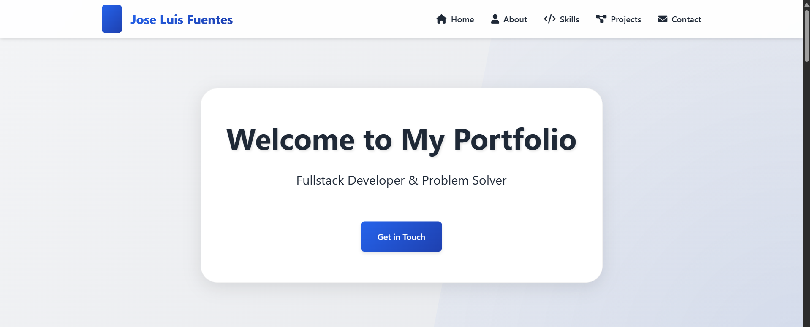

# Personal Portfolio Website 🚀

[](https://joseluuu315.github.io/Portfolio/)
[](https://github.com/Joseluuu315/Portfolio/blob/main/LICENSE)

A modern and responsive portfolio website showcasing my work as a fullstack developer. Built with HTML5, CSS3, and JavaScript, featuring a clean design and smooth animations.



## ✨ Features

- 🌓 Dark/Light theme toggle
- 📱 Fully responsive design
- 🎯 Smooth scroll animations
- 💻 Project showcase section
- 📊 Skills visualization
- 📬 Contact form
- ⚡ Fast loading times
- 🎨 Modern UI/UX

## 🛠️ Technologies Used

- HTML5
- CSS3 (with CSS Variables)
- JavaScript (ES6+)
- Font Awesome Icons
- AOS (Animate On Scroll)
- Google Fonts

## 🚀 Getting Started

1. Clone the repository:
   ```bash
   git clone https://github.com/Joseluuu315/Portfolio.git
   ```

2. Navigate to the project directory:
   ```bash
   cd Portfolio
   ```

3. Open `index.html` in your browser or use a local server:
   ```bash
   # Using Python
   python -m http.server 8000
   # Using Node.js
   npx serve
   ```

## 📂 Project Structure

```
Portfolio/
├── src/
│   ├── assets/         # Images and resources
│   ├── styles/         # CSS files
│   │   └── home.css    # Main stylesheet
│   └── js/            # JavaScript files
│       └── animations.js
├── index.html         # Main HTML file
└── README.md         # Project documentation
```

## 🎨 Customization

1. **Colors**: Edit the CSS variables in `src/styles/home.css`
2. **Content**: Modify the HTML in `index.html`
3. **Animations**: Adjust timing in `src/js/animations.js`

## 📱 Responsive Design

The portfolio is fully responsive and optimized for:
- Desktop (1200px and above)
- Tablet (768px to 1199px)
- Mobile (below 768px)

## 🤝 Contributing

Contributions are welcome! Feel free to:
1. Fork the repository
2. Create a new branch
3. Make your changes
4. Submit a pull request

## 📄 License

This project is licensed under the MIT License - see the [LICENSE](LICENSE) file for details.

## 📬 Contact

- GitHub: [@Joseluuu315](https://github.com/Joseluuu315)
- LinkedIn: [José Luis Fuentes Parra](https://www.linkedin.com/in/jos%C3%A9-luis-fuentes-parra-80bb96257/)
- Email: joselufupa2016@gmail.com

---

Made with ❤️ by José Luis Fuentes
